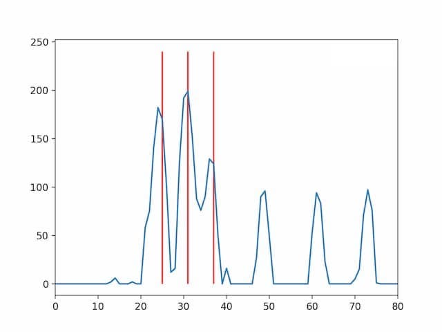

# Chords
Chords recognizes musical notes present in played audio. It runs on most modern desktop and mobile
browsers.

## Algorithm
To recognize notes, the following process is used:
- The audio input is split into 4096 sample wide chunks.
- Every 1/10 second, this buffer is transformed to a power spectrum
  in frequency space using [fast Fourier Transform](https://en.wikipedia.org/wiki/Fast_Fourier_transform).
  Frequencies that do not correspond to musical notes are discarded.
- A new analysis series is started whenever the total power in the spectrum more than doubles
  between consecutive spectra.
- Whenever an analysis series is started, a [Bayes Filter](https://en.wikipedia.org/wiki/Recursive_Bayesian_estimation)
  is used consecutively to determine which of the notes in the spectrum are being played and which
  are overtones or noise. (See [here](https://github.com/dyedgreen/chords/blob/master/analysis/Analysis.ipynb)
  for a Jupyter Notebook with examples.)

_Example Spectrum showing a C4 major. The chord is highlighted in red._

## Credits
Chords is made by [Tilman Roeder](https://tilman.xyz) for the
[SWE Project Competition](https://www.youtube.com/watch?v=KVyMIEwI7uw).
Icons based on the [In The Studio icon-set](https://iconstore.co/icons/in-the-studio/).
